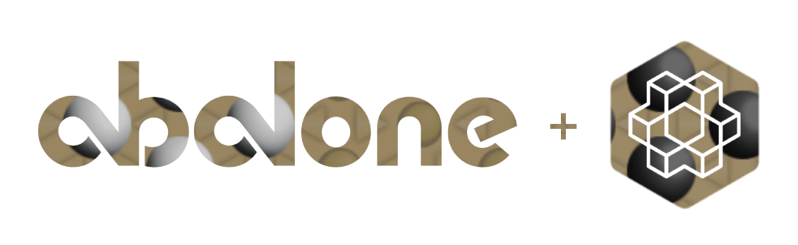

# AI - The ABALONE GAME 

     

***Abalone is a registered trademark of Abalone S.A. - France***

Submitted by - 

Omer Hagage 313525388,
Tal Avraham Hai 207601568,
Yuval Ussishkin 208489963,
Nir Amzaleg 206959686

The project includes the gym_abalone package, an open source Abalone game
package.

## Running Guidelines 
1. [Initialization](#Initialization)
2. [Play against our Agent](#Play against our Agent)
3. [Agent vs Agent](#Agent vs Agent)
   1. [Command Format](#Command Format)
   2. [Agents list](#Agents list)
   3. [Heuristics](#Heuristics)
   4. [Common Commands Examples](#Common Commands Examples)
4. [Statistics](#Statistics)
   1. [Command Format](#Command Format)
   2. [Common Commands Examples](#Common Commands Examples)

   
# Initialization
First, run those commands:
    
    cd <path_to_main_dir>
    virtualenv newEnv --python python3
    source newEnv/bin/activate.csh
    pip install -r requirements.txt

Make sure that all packages are installed successfully.

# Play against our Agent (Please try it!)
For playing against our awesome Agent (AlphaBeta Agent with depth 2) run-

     python3 -m project.game.UserVsAlphaBeta

If you by mistake won our agent please let us know, this agent is top notch.
# Agent vs Agent

## Command Format 

The command format is - 
python3 -m project.game.AgentVsAgent FirstAgent [Heuristic Depth] SecondAgent [Heuristic Depth]

While Heuristic and Depth are mandatory parameters for the MiniMax/AlphaBeta Agents and redundant for the others.

The first agent is the white player, the second is the black player.

Legal Examples - 

            Minimax defense 2         
            RandomPrioritize         
            
Illegal Examples-

            AlphaBeta                 
            RandomPrioritize attack 1 

## Agents list
Agents List -

    Random
    RandomPrioritize
    AlphaBeta
    Minimax
    QLearning

## Heuristics
Heuristics Lists-

    defense
    attack
    balance

## Common Commands Examples

Commands:

    python3 -m project.game.AgentVsAgent AlphaBeta attack 2 RandomPrioritize
    
    python3 -m project.game.AgentVsAgent AlphaBeta attack 2 Minimax defense 2
    
    python3 -m project.game.AgentVsAgent RandomPrioritize AlphaBeta balance 1
    
    python3 -m project.game.AgentVsAgent AlphaBeta attack 1 Random
    
#Statistics

## Command Format 

The command format is - 

python3 -m project.statistics.GameStatistics FirstAgent [Heuristic Depth] SecondAgent [Heuristic Depth]  NumberOfGames

While Heuristic and Depth are mandatory parameters for the MiniMax/AlphaBeta Agents and redundant for the others.

The first agent is the white player, the second is the black player.

## Common Commands Examples

Commands:

    python3 -m project.statistics.GameStatistics AlphaBeta attack 2 RandomPrioritize 5
    
    python3 -m project.statistics.GameStatistics AlphaBeta attack 2 Minimax defense 2 10
    
    python3 -m project.statistics.GameStatistics RandomPrioritize AlphaBeta balance 1 10
    
    python3 -m project.statistics.GameStatistics AlphaBeta attack 1 Random 1
